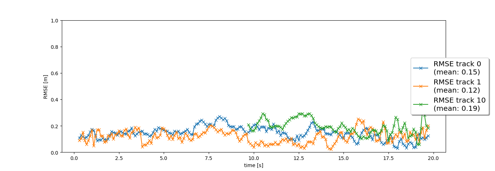
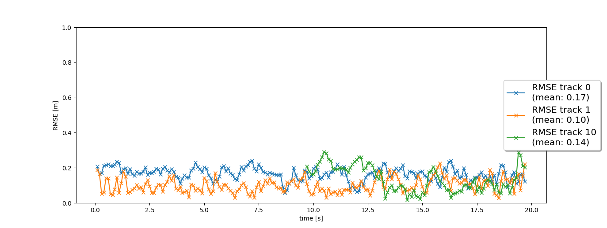
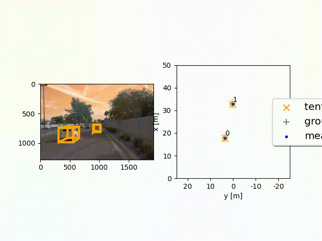

# Final-Project-Sensor-Fusion-and-Object-Tracking

This project has several task to be performed, divided as follow:
* Step 1
* Step 2
* Step 3
* step 4

## Reference code
[filter.py](Code/filter.py)
<br>
[trackmanagement.py](Code/trackmanagement.py)
<br>
[association.py](Code/association.py)
<br>
[measurements.py](Code/measurements.py)
<br>
[loop_over_dataset.py](Code/loop_over_dataset.py)

## Step 1
In this step I've implemented EKF for Lidar data only; in order to do so I've derived the equations and adapted the code from the previous excercise to fit input dimensions, which is 6D.

```
F = np.matrix([[1, 0, 0, dt, 0, 0],
               [0, 1, 0, 0, dt, 0],
               [0, 0, 1, 0, 0, dt],
               [0, 0, 0, 1, 0, 0],
               [0, 0, 0, 0, 1, 0],
               [0, 0, 0, 0, 0, 1]])
```
The formula used to calculate Q is the following one:

```
Q = 0, 0, 0, 0, 0, 0
    0, 0, 0, 0, 0, 0
    0, 0, 0, 0, 0, 0
    0, 0, 0, q, 0, 0
    0, 0, 0, 0, q, 0
    0, 0, 0, 0, 0, q
```
Using the already calculated F and Q, the resulting Q(t) is:
```
q = params.q
dt = params.dt
q1 = ((dt**3)/3) * q 
q2 = ((dt**2)/2) * q 
q3 = dt * q 
Q = np.matrix([[q1, 0, 0, q2, 0, 0],
               [0, q1, 0, 0, q2, 0],
               [0, 0, q1, 0, 0, q2],
               [q2, 0, 0, q3, 0, 0],
               [0, q2, 0, 0, q3, 0],
               [0, 0, q2, 0, 0, q3]])
```
The resulting EFK mean RMSE is 0.32, which is lower than the request.

<p align="center">
  
</p>

<p align="center">
  
</p>

## Step 2
The aim of the step is to initialize, update (score and or state) and delete tracks. In the simulation, track 0 has been detected and shortly after confirmed without losses between frames; RMSE of the step is shown in the chart below:
<p align="center">
  
</p>

## Step 3
In this step I've implemented the association matrix based on Mahalanobis distance with gating technique in order to reduce computational complexity; RMSE of the step is shown in the chart below:
<p align="center">
  
</p>

## Step 4
The aim of the step is to implement data fusion in order to increase performance, adding data from the camera sensor. RMSE of the step is shown in the chart below:
<p align="center">
  
</p>
Compared to RMSE of step 3 the overall performance is increased. The following animation shows the result of data fusion:

<p align="center">
  
</p>
